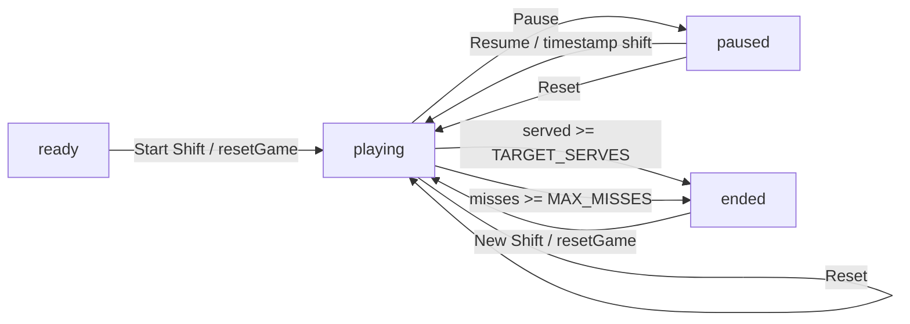

# Game Architecture

[Docs index](./README.md) | [Repo README](../README.md)

## File Ownership

| File | Responsibility |
| --- | --- |
| `src/App.tsx` | Owns all game data, state, generation, timers, components, audio helpers, scoring, and rendering. |
| `src/styles.css` | Owns all visual treatment, game scene layering, animations, and responsive behavior. |
| `src/main.tsx` | Mounts the React app and imports `styles.css`. |

## Main Types

All types below live in `src/App.tsx`.

| Type | Purpose |
| --- | --- |
| `FoodId` | Union of supported food IDs: `rice`, `fish`, `chicken`, `egg`, `noodles`, `soup`, `salad`, `tea`, `bread`. |
| `Food` | Food catalog row with `id` and display `name`. |
| `CustomerProfile` | Customer catalog row with `id` and display `name`. |
| `DifficultyProfile` | Derived per-level limits and timer values. |
| `ActiveGuest` | Runtime guest instance, order foods, served foods, phrase, timestamps, and level. |
| `ScheduledFood` | Future ordered food waiting to spawn on the belt. |
| `BeltFood` | Visible conveyor food button, including target guest, lane, spawn time, and travel time. |
| `Feedback` | Status text and visual kind: `neutral`, `good`, or `bad`. |
| `GameStatus` | `ready`, `playing`, `paused`, or `ended`. |
| `SoundKind` | `correct`, `complete`, or `wrong`. |

## Static Data

| Symbol | Purpose |
| --- | --- |
| `FOODS` | Food catalog used for order generation and labels. |
| `foodArtById` | Maps each `FoodId` to an imported PNG sprite. |
| `CUSTOMERS` | Customer profile rotation. Note: customer ID `mai` displays as `Mia`. |
| `customerSpriteById` | Maps each customer ID to an imported PNG sprite. |
| `foodById` | Lookup map derived from `FOODS`. |

## Components

| Component | Role |
| --- | --- |
| `App` | Top-level game engine, state owner, effects owner, and render tree. |
| `GuestCard` | Guest order card, order replay button, food checklist, patience timer, selected state. |
| `ConveyorBelt` | Belt panel and visible clickable `BeltFood` items. |
| `EnginePanel` | Difficulty readout and generated sprite sheet preview. |
| `FoodArt` | Image wrapper for a food sprite. |
| `CustomerSprite` | Image wrapper for a customer sprite. |
| `StatPill` | Reusable stat display in the score strip. |

## State And Refs

`App` owns the game state directly with React hooks.

| State/ref | Type | Purpose |
| --- | --- | --- |
| `gameStatus` | `GameStatus` | Controls ready/play/pause/end behavior. |
| `now` | number | Clock value updated every `100ms` while playing. |
| `activeGuests` | `ActiveGuest[]` | Guest cards currently in the game. |
| `selectedGuestId` | `string | null` | Preferred guest for matching visible food. |
| `scheduledFoods` | `ScheduledFood[]` | Ordered foods waiting for their due time. |
| `beltFoods` | `BeltFood[]` | Foods currently visible on the conveyor. |
| `score` | number | Total points. |
| `served` | number | Completed guest orders. |
| `streak` | number | Consecutive correct food clicks. |
| `misses` | number | Wrong serves or expired guests. |
| `feedback` | `Feedback` | Status message and color state. |
| `guestSequenceRef` | ref number | Monotonic guest sequence for deterministic rotation and IDs. |
| `foodSequenceRef` | ref number | Monotonic food sequence for decoys/recycles/IDs. |
| `nextGuestAtRef` | ref number | Next allowed guest spawn time. |
| `nextDecoyAtRef` | ref number | Next allowed decoy spawn time. |
| `pauseStartedRef` | ref number/null | Wall-clock time when pause began. |
| `audioContextRef` | ref `AudioContext`/null | Lazily created Web Audio context. |

## Status Flow



| Status | UI button label | Behavior |
| --- | --- | --- |
| `ready` | `Start Shift` | `resetGame` seeds two level-1 guests and starts play. |
| `playing` | `Pause` | Timers and generation effects run. |
| `paused` | `Resume` | `resumeGame` shifts timestamps by the paused duration. |
| `ended` | `New Shift` | Result banner appears; starting again calls `resetGame`. |

The reset icon always calls `resetGame`.

## Gameplay Constants

| Constant | Value | Meaning |
| --- | --- | --- |
| `TARGET_SERVES` | `24` | Completed guest orders required to win. |
| `MAX_MISSES` | `5` | Misses that end the shift. |
| `ORDERS_PER_LEVEL` | `4` | Completed orders per level. |
| `MAX_LEVEL` | `6` | Derived from `Math.ceil(TARGET_SERVES / ORDERS_PER_LEVEL)`. |
| `STREAK_BONUS_PER_HIT` | `8` | Added per streak step after the first hit. |
| `FIRST_DISH_DELAY_MS` | `1800` | Delay before first ordered dish can spawn. |
| `NEXT_GUEST_AFTER_COMPLETE_MS` | `3000` | Minimum delay before spawning after a completed order when needed. |
| `ORDER_LANES` | `2` | Conveyor lanes. |

## Difficulty Table

Values are derived by `difficultyForLevel(level)`.

| Level | Max guests | Order size | Time to last dish | Dish gap | Guest interval | Belt travel | Decoy interval | Patience buffer |
| --- | ---: | ---: | ---: | ---: | ---: | ---: | ---: | ---: |
| 1 | 2 | 2 | 7200ms | 7200ms | 5600ms | 12500ms | 3900ms | 12000ms |
| 2 | 2 | 2 | 9450ms | 9450ms | 5240ms | 12240ms | 3760ms | 13200ms |
| 3 | 3 | 2 | 11700ms | 11700ms | 4880ms | 11980ms | 3620ms | 14400ms |
| 4 | 3 | 3 | 13950ms | 6975ms | 4520ms | 11720ms | 3480ms | 15600ms |
| 5 | 4 | 3 | 16200ms | 8100ms | 4160ms | 11460ms | 3340ms | 16800ms |
| 6 | 4 | 3 | 18450ms | 9225ms | 3800ms | 11200ms | 3200ms | 18000ms |

## Order Generation

| Function | Behavior |
| --- | --- |
| `levelForServed(served)` | `floor(served / ORDERS_PER_LEVEL) + 1`, clamped to `1..MAX_LEVEL`. |
| `selectFoods(sequence, count, level)` | Deterministically chooses unique foods from `FOODS` using cursor `(sequence * 3 + level) % FOODS.length`, advancing by `3`. |
| `makeGuest(sequence, now, profile)` | Picks `CUSTOMERS[sequence % CUSTOMERS.length]`, selects foods, builds phrase `Could I please have ...?`, creates `ActiveGuest`, and schedules each ordered food. |
| `makeDecoyFood(sequence, now, profile)` | Creates untargeted belt food from `(sequence * 5 + profile.level) % FOODS.length`. |
| `chooseSpawnLane(preferredLane, currentFoods, now)` | Uses the preferred lane or the other lane if all existing foods in that lane have moved past `24%` progress; returns `null` when blocked. |

`targetGuestId` helps priority, but it is not a strict lock. In `handleFoodClick`, food goes first to its owning guest if that guest still needs it, then to the selected guest if possible, then to the first active guest who needs that food. This means a decoy can still count if a guest needs that food.

## Timers And Effects

| Effect | Runs when | Behavior |
| --- | --- | --- |
| Clock | `gameStatus === "playing"` | Updates `now` every `100ms`. |
| Guest and decoy spawning | Playing, `now` changes | Adds guests while under `difficulty.maxGuests`; adds decoys on `nextDecoyAtRef` if a lane is clear. |
| Scheduled food spawning | Playing, scheduled foods due | Converts due `ScheduledFood` entries into `BeltFood`; blocked lanes delay the food by `650ms`. |
| Belt cleanup and recycle | Playing, belt foods move | Removes food after travel. Targeted food recycles if its target guest still needs it; decoys disappear. |
| Guest expiration | Playing, guests expire | Removes expired guests and their targeted foods, clears selection if needed, and calls `addMiss`. |
| Selection repair | Active guests change | Selects the first active guest if the previous selection no longer exists. |
| Cleanup | Unmount | Closes the audio context and cancels speech synthesis. |

## Serving, Scoring, And Lives

| Event | Result |
| --- | --- |
| Correct food, order not complete | Food is removed, guest checklist updates, score increases, streak increases, `correct` sound plays. |
| Correct food completes order | Guest is removed, `served` increments, scheduled leftovers for that guest are removed, `complete` sound plays. |
| No guest needs clicked food | Food is removed, `misses` increments, streak resets, `wrong` sound plays. |
| Guest expires | Guest and targeted foods are removed, `misses` increments, streak resets. |
| `misses >= MAX_MISSES` | `gameStatus` becomes `ended`; result banner says `Kitchen closed`. |
| `served >= TARGET_SERVES` | `gameStatus` becomes `ended`; result banner says `Shift complete`. |

Per correct food click:

```text
nextStreak = streak + 1
timeBonus = max(0, ceil((matchingGuest.expiresAt - Date.now()) / 1000))
levelBonus = difficulty.level * 5
streakBonus = max(0, nextStreak - 1) * STREAK_BONUS_PER_HIT
earned = 35 + timeBonus + levelBonus + streakBonus
```

The displayed `Orders` stat is completed guest orders, not individual dishes.
