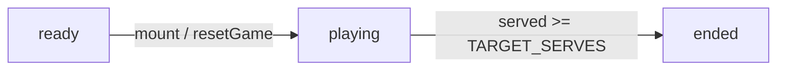

# Game Architecture

[Docs index](./README.md) | [Repo README](../README.md)

## File Ownership

| File | Responsibility |
| --- | --- |
| `src/App.tsx` | Owns all game data, state, generation, timers, components, audio helpers, scoring, and rendering. |
| `src/styles.css` | Owns all visual treatment, game scene layering, animations, and responsive behavior. |
| `src/main.tsx` | Mounts the React app and imports `styles.css`. |

## Main Types

All types below live in `src/App.tsx`.

| Type | Purpose |
| --- | --- |
| `FoodId` | Union of supported food IDs: `rice`, `fish`, `chicken`, `egg`, `noodles`, `soup`, `salad`, `tea`, `bread`. |
| `Food` | Food catalog row with `id` and display `name`. |
| `CustomerProfile` | Customer catalog row with `id` and display `name`. |
| `WalkDirection` | Cardinal direction used to pick waiter and customer sprite frames. |
| `TilePoint` | Diner movement grid coordinate with `col` and `row`. |
| `SeatLayout` | Per-seat table, customer, waiter, and speech-bubble placement data. |
| `DifficultyProfile` | Derived per-level limits and timer values. |
| `ActiveGuest` | Runtime guest instance, order foods, served foods, phrase, timestamps, and level. |
| `ScheduledFood` | Future ordered food waiting to spawn on the kitchen pass. |
| `BeltFood` | Visible kitchen-pass dish button, including target guest, lane, spawn time, and travel time. |
| `DraggingDish` | Active pointer/native drag state for the dish preview. |
| `CharacterVisual` | Interpolated tile position plus direction/walking/done flags for actors. |
| `WaiterRoute` | Current waiter path, target guest, start timestamp, and step duration. |
| `Feedback` | Status text and visual kind: `neutral`, `good`, or `bad`. |
| `GameStatus` | `ready`, `playing`, `paused`, or `ended`. |
| `SoundKind` | `correct`, `complete`, or `wrong`. |

## Static Data

| Symbol | Purpose |
| --- | --- |
| `FOODS` | Food catalog used for order generation and labels. |
| `foodArtById` | Maps each `FoodId` to an imported PNG sprite. |
| `CUSTOMERS` | Customer profile rotation. Note: customer ID `mai` displays as `Mia`. |
| `customerSpriteRowById` | Maps each customer ID to a row in `customer-fullbody-sheet.png`. |
| `customerFullbodySheetUrl` | Generated full-body customer sprite sheet used by `CustomerSprite`. |
| `waiterFullbodySheetUrl` | Generated full-body waiter sprite sheet used by `PlayerSprite`. |
| `DINER_DOOR_TILE` | Tile where entering/leaving guests start and end. |
| `WAITER_HOME_TILE` | Initial waiter tile on reset. |
| `DINER_AISLE_ROW` | Shared aisle row used by `buildTileRoute`. |
| `SEAT_LAYOUT` | Six table/customer/waiter tile layouts plus speech-bubble offsets. |
| `WALK_TILES` | Visible tile markers rendered by `RestaurantStage`. |
| `foodById` | Lookup map derived from `FOODS`. |

## Components

| Component | Role |
| --- | --- |
| `App` | Top-level route chooser for the portal and game routes. |
| `RestaurantGame` | Table Talk Diner engine, state owner, effects owner, and render tree. |
| `RestaurantStage` | Top-down diner floor, guest tables, kitchen station, drag preview, and waiter sprite. |
| `GuestTable` | Guest table button, speech bubble, food chips, patience timer, selected/drop state. |
| `CustomerActor` | Absolute-positioned customer sprite actor driven by `getGuestVisual`. |
| `KitchenStation` | Kitchen pass and visible draggable `BeltFood` dish buttons. |
| `PlayerSprite` | Generated full-body waiter sprite sheet wrapper driven by `waiterVisual`. |
| `FoodArt` | Image wrapper for a food sprite. |
| `CustomerSprite` | Generated full-body customer sprite sheet wrapper. |
| `StatPill` | Reusable stat display in the score strip. |

## State And Refs

`App` owns the game state directly with React hooks.

| State/ref | Type | Purpose |
| --- | --- | --- |
| `gameStatus` | `GameStatus` | Controls ready/play/pause/end behavior. |
| `now` | number | Clock value updated every `100ms` while playing. |
| `activeGuests` | `ActiveGuest[]` | Guests currently seated, entering, or leaving. |
| `selectedGuestId` | `string | null` | Preferred guest for matching visible food. |
| `scheduledFoods` | `ScheduledFood[]` | Ordered foods waiting for their due time. |
| `beltFoods` | `BeltFood[]` | Dishes currently visible on the kitchen pass. |
| `score` | number | Total points. |
| `served` | number | Completed guest orders. |
| `combo` | number | Consecutive happy guests completed without a wrong table or expired guest. |
| `draggingDish` | `DraggingDish | null` | Current custom pointer drag preview state. |
| `waiterTile` | `TilePoint` | Last settled waiter tile when no route is active. |
| `waiterRoute` | `WaiterRoute | null` | Active waiter movement path to a selected guest table. |
| `pendingOrderGuestId` | `string | null` | Guest whose order should be revealed after the waiter route completes and the guest is seated. |
| `feedback` | `Feedback` | Status message and color state; maintained for diner logic but not currently rendered by diner JSX. |
| `guestSequenceRef` | ref number | Monotonic guest sequence for deterministic rotation and IDs. |
| `foodSequenceRef` | ref number | Monotonic food sequence for decoys/recycles/IDs. |
| `nextGuestAtRef` | ref number | Next allowed guest spawn time. |
| `nextDecoyAtRef` | ref number | Next allowed decoy spawn time. |
| `audioContextRef` | ref `AudioContext`/null | Lazily created Web Audio context. |
| `draggingDishRef` | ref `DraggingDish | null` | Current drag state used by global pointer handlers. |
| `consumedDishIdsRef` | ref `Set<string>` | Prevents a dish from being served twice through duplicate drop events. |

## Status Flow



| Status | UI button label | Behavior |
| --- | --- | --- |
| `ready` | Not rendered in diner | `resetGame` runs on mount, seeds two level-1 guests, and starts play. |
| `playing` | Not rendered in diner | Timers, guest spawning, dish spawning, drag/drop, expiration, and scoring effects run. |
| `ended` | Not rendered in diner | Result banner appears after `served >= TARGET_SERVES`. |

`GameStatus` is shared with Tiny City Delivery, but Table Talk Diner currently does not expose
pause/resume/reset controls in its route UI.

## Gameplay Constants

| Constant | Value | Meaning |
| --- | --- | --- |
| `TARGET_SERVES` | `24` | Completed guest orders required to win. |
| `ORDERS_PER_LEVEL` | `4` | Completed orders per level. |
| `MAX_LEVEL` | `6` | Derived from `Math.ceil(TARGET_SERVES / ORDERS_PER_LEVEL)`. |
| `HAPPY_GUEST_COMBO_BONUS` | `15` | Added per completed happy-guest combo step after the first completed guest. |
| `FIRST_DISH_DELAY_MS` | `1800` | Delay before first ordered dish can spawn. |
| `NEXT_GUEST_AFTER_COMPLETE_MS` | `3000` | Minimum delay before spawning after a completed order when needed. |
| `GUEST_STEP_MS` | `260` | Milliseconds per guest tile-route segment. |
| `WAITER_STEP_MS` | `230` | Milliseconds per waiter tile-route segment. |
| `LEAVING_GUEST_LINGER_MS` | `350` | Extra delay after a leaving guest's reverse route before removal. |
| `ORDER_LANES` | `2` | Kitchen-pass lane offsets. |

## Difficulty Table

Values are derived by `difficultyForLevel(level)`.

| Level | Max guests | Order size | Time to last dish | Dish gap | Guest interval | Belt travel | Decoy interval | Patience buffer |
| --- | ---: | ---: | ---: | ---: | ---: | ---: | ---: | ---: |
| 1 | 2 | 2 | 7200ms | 7200ms | 5600ms | 12500ms | 3900ms | 12000ms |
| 2 | 2 | 2 | 9450ms | 9450ms | 5240ms | 12240ms | 3760ms | 13200ms |
| 3 | 3 | 2 | 11700ms | 11700ms | 4880ms | 11980ms | 3620ms | 14400ms |
| 4 | 3 | 3 | 13950ms | 6975ms | 4520ms | 11720ms | 3480ms | 15600ms |
| 5 | 4 | 3 | 16200ms | 8100ms | 4160ms | 11460ms | 3340ms | 16800ms |
| 6 | 4 | 3 | 18450ms | 9225ms | 3800ms | 11200ms | 3200ms | 18000ms |

## Order Generation

| Function | Behavior |
| --- | --- |
| `levelForServed(served)` | `floor(served / ORDERS_PER_LEVEL) + 1`, clamped to `1..MAX_LEVEL`. |
| `selectFoods(sequence, count, level)` | Deterministically chooses unique foods from `FOODS` using cursor `(sequence * 3 + level) % FOODS.length`, advancing by `3`. |
| `makeGuest(sequence, now, profile)` | Picks `CUSTOMERS[sequence % CUSTOMERS.length]`, selects foods, builds a phrase through `makeOrderPhrase`, creates `ActiveGuest`, and schedules each ordered food. |
| `makeDecoyFood(sequence, now, profile)` | Creates untargeted belt food from `(sequence * 5 + profile.level) % FOODS.length`. |
| `chooseSpawnLane(preferredLane, currentFoods, now)` | Uses the preferred lane or the other lane if all existing foods in that lane have moved past `24%` progress; returns `null` when blocked. |
| `buildTileRoute(start, end, aisleRow)` | Builds a row/column path through the shared aisle and removes duplicate adjacent points. |
| `getRouteVisual(path, startedAt, now, stepMs)` | Interpolates a route into actor tile coordinates, walk direction, and completion state. |
| `getGuestVisual(guest, now)` | Uses a forward route for entering guests, reverse route for leaving guests, and the seat tile for seated guests. |

`targetGuestId` is used to recycle/remove scheduled dishes for their owning guest. Serving is decided
by the guest table passed to `handleFoodDrop`, so a decoy can still count if the player drops it on a
guest who needs that food.

## Timers And Effects

| Effect | Runs when | Behavior |
| --- | --- | --- |
| Clock | `gameStatus === "playing"` | Updates `now` every `100ms`. |
| Guest arrival | Playing, entering guests complete their tile route | Converts entering guests to `seated`. |
| Waiter route completion | `waiterRoute` and `now` changes | Stores the final tile, clears the route, and marks `pendingOrderGuestId`. |
| Pending order reveal | `pendingOrderGuestId` or active guests change | Calls `revealGuestOrder` once the target guest exists, is not leaving, and is no longer entering. |
| Guest and decoy spawning | Playing, `now` changes | Adds guests while under `difficulty.maxGuests`; adds decoys on `nextDecoyAtRef` if a lane is clear. |
| Scheduled food spawning | Playing, scheduled foods due | Converts due `ScheduledFood` entries into `BeltFood`; blocked lanes delay the food by `650ms`. |
| Belt cleanup and recycle | Playing, belt foods age past `travelMs` | Removes food after travel. Targeted food recycles if its target guest still needs it; decoys disappear. |
| Guest expiration | Playing, guests expire | Marks expired guests leaving, removes their targeted foods, clears selection if needed, plays `wrong`, and resets combo. |
| Selection repair | Active guests change | Clears the selected guest if the previous selection no longer exists. |
| Leaving guest cleanup | Active guests or `now` changes | Removes leaving guests after their reverse tile route plus `LEAVING_GUEST_LINGER_MS`. |
| Cleanup | Unmount | Closes the audio context and cancels speech synthesis. |

## Serving, Scoring, And Completion

| Event | Result |
| --- | --- |
| Correct food, order not complete | Food is removed, guest checklist updates, score increases, and `correct` sound plays. |
| Correct food completes order | Guest enters leaving phase, `served` increments, `combo` increments, scheduled/visible leftovers for that guest are removed, and `complete` sound plays. |
| Dish dropped on wrong table | Food is removed, `combo` resets, and `wrong` sound plays. |
| Guest expires | Guest enters leaving phase, targeted foods are removed, `combo` resets, and `wrong` sound plays. |
| `served >= TARGET_SERVES` | `gameStatus` becomes `ended`; result banner says `Dinner service complete`. |

Per correct dish drop:

```text
timeBonus = max(0, ceil((matchingGuest.expiresAt - Date.now()) / 1000))
levelBonus = difficulty.level * 5
nextCombo = completedGuest ? combo + 1 : combo
comboBonus = completedGuest ? max(0, nextCombo - 1) * HAPPY_GUEST_COMBO_BONUS : 0
earned = 35 + timeBonus + levelBonus + comboBonus
```

The displayed `Orders` stat is completed guest orders, not individual dishes.
