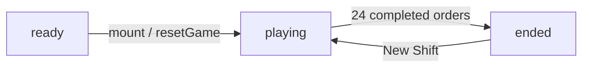
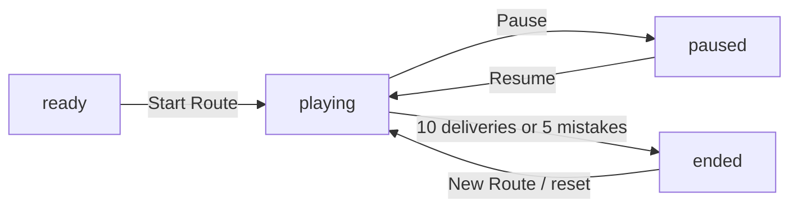

# Game Architecture

[Docs index](./README.md) | [Repo README](../README.md)

## File Ownership

| File | Responsibility |
| --- | --- |
| `src/App.tsx` | Portal, History API routing, game data/state, timers, scoring, speech, tones, and scene snapshots. |
| `src/game-runtime/PhaserGameHost.tsx` | Creates, resizes, and destroys the shared Phaser runtime boundary. |
| `src/games/dish-wish/DishWishStage.tsx` | React-to-Phaser Dish Wish adapter and keyboard controls. |
| `src/games/dish-wish/DishWishScene.ts` | Dish Wish grid, sprite, timer, hit-test, and drag rendering. |
| `src/games/drop-hop/DropHopMap.tsx` | React-to-Phaser Drop Hop adapter and keyboard controls. |
| `src/games/drop-hop/DropHopScene.ts` | Drop Hop map, road, stop, courier, and tween rendering. |
| `src/styles.css` | Portal/HUD/page layout, canvas sizing, accessible controls, and responsive behavior. |
| `src/main.tsx` | React mount and global CSS import. |
| `index.html` | Document metadata and Vite entry. |

## Portal And Routing

`App` stores a canonical copy of `window.location.pathname`. `normalizePath` removes trailing
slashes while preserving `/`, and `canonicalizePath` maps legacy game paths to their current routes.

| Symbol | Role |
| --- | --- |
| `DISH_WISH_PATH` | Canonical `/games/dish-wish` path. |
| `DROP_HOP_PATH` | Canonical `/games/drop-hop` path. |
| `LEGACY_DISH_WISH_PATH` | `/games/table-talk-diner` compatibility alias. |
| `LEGACY_DROP_HOP_PATH` | `/games/tiny-city-delivery` compatibility alias. |
| `GamePortal` | Root chooser with two real anchors and image/CSS previews. |
| `navigateToGame` | Calls `history.pushState` when needed and updates route state. |
| `popstate` effect | Keeps rendered content aligned with browser back/forward and canonicalizes aliases with `replaceState`. |
| title effect | Sets a route-specific `document.title`. |

Ordinary card clicks use in-app navigation. Modified clicks and non-primary clicks preserve anchor
semantics. Legacy paths render the matching game immediately and replace their URL with the
canonical path. Unknown paths fall back to the portal without rewriting the URL. Static hosts must
route direct requests for canonical and legacy `/games/...` paths to `index.html`.

## Shared Types And Helpers

| Type/helper | Purpose |
| --- | --- |
| `GameStatus` | Shared union: `ready`, `playing`, `paused`, `ended`. |
| `Feedback` | `neutral`, `good`, or `bad` status text. |
| `SoundKind` | `correct`, `complete`, or `wrong` tone pattern. |
| `speak` | Browser speech synthesis wrapper. |
| `scheduleTone` | Low-level Web Audio oscillator/gain envelope. |
| `StatPill` | Shared score/status display. |
| `FoodArt` | Shared food-image wrapper used by both games and the portal. |

Each game owns its own `AudioContext` ref and `playSound` callback.

# Dish Wish

## Core Data Types

| Type | Purpose |
| --- | --- |
| `FoodId`, `Food` | Supported food IDs and labels. |
| `CustomerProfile` | Guest IDs and names. |
| `TilePoint`, `WalkDirection`, `CharacterVisual` | Route tiles plus interpolated customer positions, facing, walking, and route-completion state. |
| `SeatLayout` | Table/customer positions, seated facing direction, and speech-bubble offsets. |
| `DifficultyProfile` | Per-level capacity and timing values. |
| `ActiveGuest` | Guest order, service, timing, seat, hearing, and movement state. |
| `ScheduledFood` | Ordered food waiting for its spawn time. |
| `BeltFood` | Visible dish, stable pass-slot index, and lifecycle metadata. |
| `DishWishSnapshot` | Presentation-only guest, dish, slot, route, patience, selection, and status values sent to Phaser. |

## Components

| Component | Role |
| --- | --- |
| `RestaurantGame` | Authoritative diner state, rule, timing, scoring, speech, and effects owner. |
| `DishWishStage` | Lazy-loaded React adapter that sends snapshots/callbacks and provides native keyboard controls. |
| `DishWishScene` | Phaser renderer for kitchen, floor, tables, guests, dishes, timers, drag/drop, and sprite animation. |
| `PhaserGameHost` | Shared instance lifecycle used by this scene and Drop Hop. |

## State And Refs

| State/ref | Purpose |
| --- | --- |
| `gameStatus`, `now` | Diner lifecycle and 100ms gameplay clock. |
| `activeGuests` | Entering, seated, and leaving guests. |
| `selectedGuestId` | Current table used by keyboard service. |
| `guidedGuestId`, `introOrderComplete` | First-order onboarding state that keeps the opening order untimed until it is served correctly. |
| `scheduledFoods`, `beltFoods` | Future and visible dishes. |
| `score`, `served`, `combo` | Progress and scoring. |
| `servedEcho` | Brief visible reinforcement card for the latest correctly served food word. |
| `feedback` | Shared diner status text used by the screen-reader live region and the visible helper panel. |
| `dishWishSnapshot` | Immutable scene view derived from React state on each render sample, including intro highlight metadata. |
| sequence/timer refs | Unique IDs and next guest/decoy times. |
| `consumedDishIdsRef` | Duplicate-drop protection. |
| `audioContextRef` | Lazily created diner Web Audio context. |

## Status Flow



The diner starts automatically. It has no mid-shift pause or reset control. The opening order is a
special untimed guided step inside `playing`; after that first correct serve, ordinary guest timing
continues normally. Completion displays a `New Shift` action. The portal button is available throughout.

## Constants

| Constant | Value | Meaning |
| --- | ---: | --- |
| `DINER_LEVELS` | 6 profiles | Per-level order targets, guest capacity, order size, and timing curve. |
| `TARGET_SERVES` | 24 | Completed guest orders required to win, derived from the profile targets. |
| `MAX_LEVEL` | 6 | Derived from the number of level profiles. |
| `HAPPY_GUEST_COMBO_BONUS` | 15 | Bonus multiplier step for consecutive completed guests. |
| `FIRST_DISH_DELAY_MS` | 1800 | Earliest ordered-dish spawn. |
| `NEXT_GUEST_AFTER_COMPLETE_MS` | 3000 | Replacement delay when the next spawn is already due. |
| `DINER_CLOCK_MS` | 100 | Gameplay and customer-route render sampling interval. |
| `CHARACTER_STEP_MS` | 360 | Guest route time per tile, with linearly interpolated rendering between tiles. |
| `LEAVING_GUEST_LINGER_MS` | 350 | Doorway fade/removal delay after a reverse exit route settles. |
| `DISH_EXIT_MS` | 360 | Time retained for a dish's serving-line exit animation. |
| `WRONG_DISH_PATIENCE_BASE_MS` | 2500 | Level-1 patience removed by an incorrect dish. |
| `WRONG_DISH_PATIENCE_PER_LEVEL_MS` | 500 | Additional wrong-dish patience loss for each level above 1. |
| `SERVED_DISH_PATIENCE_BONUS_MS` | 2000 | Patience added after each correct dish. |
| `ORDER_LANES` | 2 | Logical dish lane/lift choices. |
| `DISH_PASS_CAPACITY` | 6 | Maximum number of visible dishes occupying the kitchen pass. |

## Difficulty

| Level | Orders | Max guests | Order size | Last-dish time | Guest interval | Belt life | Decoy interval | Patience buffer |
| --- | ---: | ---: | ---: | ---: | ---: | ---: | ---: | ---: |
| 1 | 2 | 1 | 1 | 1800ms | 6600ms | 14000ms | 5200ms | 14000ms |
| 2 | 3 | 2 | 2 | 7000ms | 6000ms | 13300ms | 4600ms | 13500ms |
| 3 | 4 | 2 | 2 | 8500ms | 5400ms | 12600ms | 4100ms | 13000ms |
| 4 | 4 | 3 | 3 | 10000ms | 4800ms | 11900ms | 3600ms | 12500ms |
| 5 | 5 | 3 | 3 | 11500ms | 4200ms | 11200ms | 3100ms | 12000ms |
| 6 | 6 | 4 | 3 | 13000ms | 3600ms | 10500ms | 2600ms | 11500ms |

For one-item orders, the only dish arrives at `FIRST_DISH_DELAY_MS`; `dishGapMs` matches that delay
when recycling a missed dish. For two-item orders `dishGapMs` equals last-dish time; for three-item
orders it is half that time.

## Generation And Effects

- `selectFoods` deterministically selects unique foods for a sequence and level.
- Level 1 phrases always use the stable `I'd like …, please.` frame; later levels rotate through the
  broader polite template set.
- `chooseAvailableSeatIndex` reserves one of the four persistent table positions, including while a
  departing guest is still walking out, so two guests cannot occupy the same table.
- `makeGuest` rotates customer profiles, assigns the available table, creates the phrase, and derives
  `serviceStartsAt` from the entry route plus its final render sample. Patience and ordered-food due
  times then start at seating, from 1800ms through `timeToLastDishMs`.
- `makeDecoyFood` creates untargeted dishes.
- `chooseSpawnLane` rejects a lane until existing food has passed 24% of its lifetime.
- The pass exposes six stable dish slots. Removing a dish leaves its slot blank, the other dishes keep
  their positions, and the next eligible dish claims the first available blank. Ordered dishes retry
  after `650ms` and decoys wait when all six slots are occupied.
- `buildTileRoute` uses breadth-first search across the 10 × 5 floor while treating every table tile as
  blocked, so customers take a shortest collision-free path to and from their configured table edge.
- The 100ms clock samples customer route progress. Persistent Phaser sprites use short linear tweens
  to bridge those samples smoothly and loop the matching dedicated directional sheet row. The gait
  remains active for the final route sample before the guest becomes interactive. The same React
  clock drives route completion, spawning, dish recycling, expiration, and leaving-guest removal.
- Ordered food recycles if its owning guest still needs it; decoys animate off at the end of the pass.
- Removed dishes stay in `beltFoods` with `leavingAt` through `DISH_EXIT_MS`, then a timeout removes
  them after the serving-line exit animation.
- `revealGuestOrder` immediately reveals and speaks a seated guest's order without changing patience.
  During the opening guided order it also updates the visible helper copy toward the matching dish.
  Because `speak` cancels the current utterance, selecting another customer switches speech
  immediately while earlier revealed orders remain visible.
- The helper panel renders the current sentence, picture + lowercase word cards, replay buttons, and a
  one-second served-word echo without changing the core timing or scoring rules.
- The guided first order is exempt from expiration and wrong-dish patience loss until it is served
  correctly. Each later correct dish adds 2000ms before the updated guest is committed. An incorrect
  dish remains available and removes 2500–5000ms of that guest's patience according to level.

`targetGuestId` controls scheduled/visible dish cleanup and recycling. It is not a serving lock: the
drop target table and `needsFood` decide whether a dish is correct.

## Diner Scoring

For each correct dish:

```text
timeBonus = max(0, ceil((expiresAt - current time) / 1000))
levelBonus = current level * 5
comboBonus = completed order ? max(0, nextCombo - 1) * 15 : 0
earned = 35 + timeBonus + levelBonus + comboBonus
```

The time bonus is calculated before the correct-dish patience extension. Incorrect dishes stay on
the pass and reduce only the receiving guest's patience; score and combo are unchanged, except that
the untimed guided opener skips that penalty. Expired guests leave, animate owned dishes off, and
reset the combo. There is no miss count or diner loss state.

# Drop Hop

## Data Model

| Type/data | Purpose |
| --- | --- |
| `LocationId`, `CityLocation`, `CITY_LOCATIONS` | Map IDs, labels, kinds, and percentage coordinates. |
| `CITY_ROADS`, `cityNeighbors` | Undirected movement graph. |
| `DeliveryItem`, `CITY_ITEMS` | Cargo labels, plurals, icons, and optional food art. |
| `CityMission`, `CITY_MISSIONS` | Ticket phrase, pickup, dropoff, quantity, relation, focus words, reward, and optional required stop. |
| `getCityRoadKey` | Stable undirected edge key for exact traversed-road highlighting. |
| `DropHopSnapshot` | Presentation-only map, route, mission marker, cargo, and status values sent to Phaser. |

## Components And State

`DropHopGame` owns status, mission index, current location, cargo state, full path, score,
delivery count, streak, mistakes, last-delivered location, feedback, and its audio context.
`DropHopMap` bridges that state to `DropHopScene` and exposes native keyboard location buttons. The
scene draws and animates the city but returns only semantic location-selection events; React still
validates adjacency, pickup, required stops, scoring, and completion.

## Status Flow



Pause only blocks movement; Drop Hop has no countdown timer. Clicking the map while paused or ended
returns status-specific guidance.

## Movement And Completion

- The courier starts at the depot.
- Depot pickups begin in the basket; other cargo is picked up by arriving at or clicking its pickup
  location.
- Only neighboring locations in `cityNeighbors` are valid moves. A non-neighbor click adds one
  mistake, resets the streak, and plays wrong feedback.
- Visiting another valid location before pickup or dropoff is allowed and produces guidance, not a
  mistake.
- Delivery completes on the correct dropoff after pickup and after any `requiredStop` appears in the
  path.
- `DropHopScene` highlights only road edge keys produced from consecutive stops in the actual React path.

## City Scoring

```text
cleanPathBonus = max(0, 8 - roadsUsed) * 4
streakBonus = max(0, nextStreak - 1) * 12
earned = mission.reward + cleanPathBonus + streakBonus
```

The target is 10 deliveries, the mistake limit is 5, and the displayed level is
`clamp(floor(delivered / 2) + 1, 1, 5)`.
