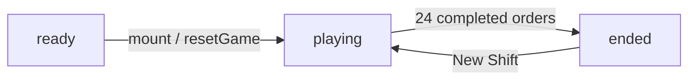
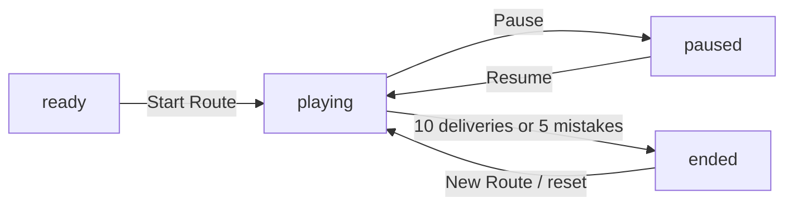

# Game Architecture

[Docs index](./README.md) | [Repo README](../README.md)

## File Ownership

| File | Responsibility |
| --- | --- |
| `src/App.tsx` | Portal, History API routing, game data, components, state, timers, scoring, speech, and tones. |
| `src/styles.css` | Portal, game layouts, scene layers, sprites, animation, and responsive behavior. |
| `src/main.tsx` | React mount and global CSS import. |
| `index.html` | Document metadata and Vite entry. |

## Portal And Routing

`App` stores a normalized copy of `window.location.pathname`. `normalizePath` removes trailing
slashes while preserving `/`.

| Symbol | Role |
| --- | --- |
| `GAME_PATH` | `/games/table-talk-diner`. |
| `TINY_CITY_PATH` | `/games/tiny-city-delivery`. |
| `GamePortal` | Root chooser with two real anchors and image/CSS previews. |
| `navigateToGame` | Calls `history.pushState` when needed and updates route state. |
| `popstate` effect | Keeps rendered content aligned with browser back/forward. |
| title effect | Sets a route-specific `document.title`. |

Ordinary card clicks use in-app navigation. Modified clicks and non-primary clicks preserve anchor
semantics. Unknown paths fall back to the portal without rewriting the URL. Static hosts must route
direct `/games/...` requests to `index.html`.

## Shared Types And Helpers

| Type/helper | Purpose |
| --- | --- |
| `GameStatus` | Shared union: `ready`, `playing`, `paused`, `ended`. |
| `Feedback` | `neutral`, `good`, or `bad` status text. |
| `SoundKind` | `correct`, `complete`, or `wrong` tone pattern. |
| `speak` | Browser speech synthesis wrapper. |
| `scheduleTone` | Low-level Web Audio oscillator/gain envelope. |
| `StatPill` | Shared score/status display. |
| `FoodArt` | Shared food-image wrapper used by both games and the portal. |

Each game owns its own `AudioContext` ref and `playSound` callback.

# Table Talk Diner

## Core Data Types

| Type | Purpose |
| --- | --- |
| `FoodId`, `Food` | Supported food IDs and labels. |
| `CustomerProfile` | Guest IDs and names. |
| `TilePoint`, `WalkDirection`, `CharacterVisual` | Tile positions and interpolated actor state. |
| `SeatLayout` | Table, customer, waiter, and speech-bubble positions. |
| `DifficultyProfile` | Per-level capacity and timing values. |
| `ActiveGuest` | Guest order, service, timing, seat, hearing, and movement state. |
| `ScheduledFood` | Ordered food waiting for its spawn time. |
| `BeltFood` | Visible dish and lifecycle metadata. |
| `DraggingDish` | Current custom/native drag preview data. |
| `WaiterRoute` | Waiter path and timing. |

## Components

| Component | Role |
| --- | --- |
| `RestaurantGame` | Diner state and effects owner. |
| `RestaurantStage` | Full-viewport floor, tables, actors, kitchen, and drag preview. |
| `GuestTable` | Interactive table, speech bubble, food checklist, and patience progressbar. |
| `CustomerActor` | Independently moving guest sprite. |
| `KitchenStation` | Dish rail and keyboard/pointer/native-drag controls. |
| `PlayerSprite` | Waiter sheet positioned by route interpolation. |

## State And Refs

| State/ref | Purpose |
| --- | --- |
| `gameStatus`, `now` | Diner lifecycle and 100ms gameplay clock. |
| `activeGuests` | Entering, seated, and leaving guests. |
| `selectedGuestId` | Current table used by keyboard service. |
| `scheduledFoods`, `beltFoods` | Future and visible dishes. |
| `score`, `served`, `combo` | Progress and scoring. |
| `draggingDish` / `draggingDishRef` | Rendered drag preview and event-safe current drag. |
| `waiterTile`, `waiterRoute`, `pendingOrderGuestId` | Waiter movement and deferred order reveal. |
| `feedback` | Visible diner status toast. |
| sequence/timer refs | Unique IDs and next guest/decoy times. |
| `consumedDishIdsRef` | Duplicate-drop protection. |
| `audioContextRef` | Lazily created diner Web Audio context. |

## Status Flow



The diner starts automatically. It has no mid-shift pause or reset control. Completion displays a
`New Shift` action. The portal button is available throughout.

## Constants

| Constant | Value | Meaning |
| --- | ---: | --- |
| `TARGET_SERVES` | 24 | Completed guest orders required to win. |
| `ORDERS_PER_LEVEL` | 4 | Completed orders per level. |
| `MAX_LEVEL` | 6 | Derived target level count. |
| `HAPPY_GUEST_COMBO_BONUS` | 15 | Bonus multiplier step for consecutive completed guests. |
| `FIRST_DISH_DELAY_MS` | 1800 | Earliest ordered-dish spawn. |
| `NEXT_GUEST_AFTER_COMPLETE_MS` | 3000 | Replacement delay when the next spawn is already due. |
| `GUEST_STEP_MS` | 320 | Guest route time per tile segment. |
| `WAITER_STEP_MS` | 440 | Waiter route time per tile segment. |
| `LEAVING_GUEST_LINGER_MS` | 350 | Removal delay after a reverse exit route. |
| `ORDER_LANES` | 2 | Logical dish lane/lift choices. |

## Difficulty

| Level | Max guests | Order size | Last-dish time | Guest interval | Belt life | Decoy interval | Patience buffer |
| --- | ---: | ---: | ---: | ---: | ---: | ---: | ---: |
| 1 | 2 | 2 | 7200ms | 5600ms | 12500ms | 3900ms | 12000ms |
| 2 | 2 | 2 | 9450ms | 5240ms | 12240ms | 3760ms | 13200ms |
| 3 | 3 | 2 | 11700ms | 4880ms | 11980ms | 3620ms | 14400ms |
| 4 | 3 | 3 | 13950ms | 4520ms | 11720ms | 3480ms | 15600ms |
| 5 | 4 | 3 | 16200ms | 4160ms | 11460ms | 3340ms | 16800ms |
| 6 | 4 | 3 | 18450ms | 3800ms | 11200ms | 3200ms | 18000ms |

For two-item orders, `dishGapMs` equals last-dish time. For three-item orders it is half that time.

## Generation And Effects

- `selectFoods` deterministically selects unique foods for a sequence and level.
- `makeGuest` rotates customer profiles, creates the phrase and expiration, and schedules each
  ordered food from 1800ms through `timeToLastDishMs`.
- `makeDecoyFood` creates untargeted dishes.
- `chooseSpawnLane` rejects a lane until existing food has passed 24% of its lifetime.
- `buildTileRoute` routes actors through the diner aisle; `getRouteVisual` interpolates position and
  direction.
- The 100ms clock drives guest entry, waiter completion, spawning, dish recycling, expiration, and
  leaving-guest removal.
- Ordered food recycles if its owning guest still needs it; decoys disappear at the end of the pass.

`targetGuestId` controls scheduled/visible dish cleanup and recycling. It is not a serving lock: the
drop target table and `needsFood` decide whether a dish is correct.

## Diner Scoring

For each correct dish:

```text
timeBonus = max(0, ceil((expiresAt - current time) / 1000))
levelBonus = current level * 5
comboBonus = completed order ? max(0, nextCombo - 1) * 15 : 0
earned = 35 + timeBonus + levelBonus + comboBonus
```

Wrong-table drops remove the dish and reset the combo. Expired guests leave, lose their owned dishes,
and reset the combo. There is no miss count or diner loss state.

# Tiny City Delivery

## Data Model

| Type/data | Purpose |
| --- | --- |
| `LocationId`, `CityLocation`, `CITY_LOCATIONS` | Map IDs, labels, kinds, and percentage coordinates. |
| `CITY_ROADS`, `cityNeighbors` | Undirected movement graph. |
| `DeliveryItem`, `CITY_ITEMS` | Cargo labels, plurals, icons, and optional food art. |
| `CityMission`, `CITY_MISSIONS` | Ticket phrase, pickup, dropoff, quantity, relation, focus words, reward, and optional required stop. |
| `getCityRoadKey` | Stable undirected edge key for exact traversed-road highlighting. |

## State

`TinyCityDeliveryGame` owns status, mission index, current location, cargo state, full path, score,
delivery count, streak, mistakes, last-delivered location, feedback, and its audio context.

## Status Flow



Pause only blocks movement; Tiny City has no countdown timer. Clicking the map while paused or ended
returns status-specific guidance.

## Movement And Completion

- The courier starts at the depot.
- Depot pickups begin in the basket; other cargo is picked up by arriving at or clicking its pickup
  location.
- Only neighboring locations in `cityNeighbors` are valid moves. A non-neighbor click adds one
  mistake, resets the streak, and plays wrong feedback.
- Visiting another valid location before pickup or dropoff is allowed and produces guidance, not a
  mistake.
- Delivery completes on the correct dropoff after pickup and after any `requiredStop` appears in the
  path.
- `CityMap` highlights only road edges that occur consecutively in the actual path.

## City Scoring

```text
cleanPathBonus = max(0, 8 - roadsUsed) * 4
streakBonus = max(0, nextStreak - 1) * 12
earned = mission.reward + cleanPathBonus + streakBonus
```

The target is 10 deliveries, the mistake limit is 5, and the displayed level is
`clamp(floor(delivered / 2) + 1, 1, 5)`.
